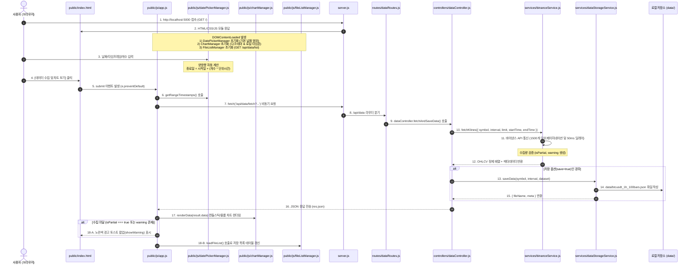

# 서버 및 프론트엔드 아키텍처 가이드 (Architecture & Interaction Flow)

본 문서는 `cabt_drl` 프로젝트의 전체 시스템 구성 요소(Express 백엔드, 프론트엔드 UI/JS 모듈, 서비스 및 저장소 모듈)와 데이터 수집/관리 흐름, 그리고 보안 및 예외 처리 아키텍처를 종합 정리한 설명서입니다.

---

## 1. 프로젝트 전체 모듈 구조 (Directory Architecture)

[AGENTS.md](file:///e:/Devs/cabt_drl/AGENTS.md)의 모듈화 규칙(단일 책임 원칙, 파일당 200~300줄 이하)에 따라 백엔드뿐만 아니라 프론트엔드도 역할별로 깔끔하게 모듈화되어 있습니다.

```text
cabt_drl/
├── server.js                   # Express 서버 진입점 (미들웨어, 라우팅, 정적 서빙)
├── config/
│   └── constants.js            # API URL, 포트, 지원 타임프레임 등 공통 상수
├── routes/
│   └── dataRoutes.js           # /api/data/* 엔드포인트 라우팅
├── controllers/
│   └── dataController.js       # 요청 파싱 및 서비스 오케스트레이션 (싱글톤)
├── services/
│   ├── binanceService.js       # 바이낸스 선물 Klines API 통신 및 자동 페이지네이션
│   └── dataStorageService.js   # data/ 로컬 파일 읽기/쓰기/삭제 및 보안 격리 (싱글톤)
├── public/                     # 브라우저 프론트엔드 GUI
│   ├── index.html              # HTML 레이아웃 (차트 카드, 수집 폼, 파일 테이블)
│   ├── css/
│   │   └── style.css           # 다크 테마 UI, 차트 뷰어 및 경고 토스트 스타일
│   └── js/
│       ├── chartManager.js      # [차트 모듈] TradingView 캔들스틱/볼륨 렌더링 & 로컬 타임존
│       ├── datePickerManager.js # [날짜 모듈] Flatpickr 24시간 피커 & 시작/종료일 양방향 자동 계산
│       ├── fileListManager.js   # [파일 관리 모듈] 저장 파일 목록 로드, 테이블 렌더링, 삭제
│       └── app.js               # [메인 오케스트레이터] 모듈 조율 및 수집 폼 제출 총괄
└── data/                       # 수집된 OHLCV 캔들 JSON 파일 저장소
```

---

## 2. 사용자 상호작용 및 데이터 흐름도 (Sequence Diagram)

사용자가 웹 브라우저 화면에서 **데이터 수집 요청**을 보내거나 **저장된 파일의 차트를 열람**할 때의 처리 흐름입니다.



---

## 3. 핵심 모듈별 역할 및 설계 특징

### 3.1. 프론트엔드 계층 (`public/`)

프론트엔드는 단일 파일의 비대화를 방지하고 유지보수성을 극대화하기 위해 4개의 모듈로 분리되었습니다.

* **`public/js/chartManager.js` (차트 렌더링 모듈)**
  * TradingView Lightweight Charts 라이브러리를 래핑하는 전용 클래스.
  * **다크 테마 캔들스틱 & 볼륨 오버레이**: 상승(녹색 `#26a69a`), 하락(적색 `#ef5350`) 적용.
  * **로컬 타임존(KST) 변환**: `localization.timeFormatter`와 `timeScale.tickMarkFormatter`를 통해 차트 축과 툴팁에 한국 시간(`YYYY-MM-DD HH:mm`)을 정확히 표시.
  * **반응형 리사이징 & 포지션 마커**: 창 크기 변경 시 자동 조절 및 향후 DRL 매수/매도 신호 시각화용 `setMarkers()` 지원.

* **`public/js/datePickerManager.js` (날짜 및 계산 모듈)**
  * **Flatpickr 24시간제 피커**: 브라우저 로케일 간섭 없이 순수한 `YYYY-MM-DD HH:mm` 형식 보장.
  * **양방향 상호 자동 계산**:
    * 시작일시 / 타임프레임 / 목표개수 변경 시 ➡️ $\text{종료일} = \text{시작일} + (\text{개수} \times \text{단위시간})$ 자동 계산.
    * 종료일시 직접 수정 시 ➡️ $\text{목표개수} = \frac{\text{종료일} - \text{시작일}}{\text{단위시간}}$ 자동 역계산.

* **`public/js/fileListManager.js` (파일 관리 모듈)**
  * `GET /api/data/list`로 저장된 JSON 파일 목록을 비동기 조회하여 테이블 렌더링.
  * **[차트 보기]**: 저장된 파일의 데이터를 읽어와 상단 차트에 즉시 렌더링하는 콜백 연동.
  * **[삭제]**: `DELETE /api/data/file/:fileName` 요청 및 확인 팝업 처리.

* **`public/js/app.js` (메인 오케스트레이터)**
  * `ChartManager`, `DatePickerManager`, `FileListManager`를 인스턴스화하고 조율.
  * 폼 제출 시 파라미터 조합 후 백엔드 통신 및 수집 미달 경고 토스트 제어.

---

### 3.2. 백엔드 라우팅 및 제어 계층

* **`server.js` (서버 진입점)**
  * `cors()`: 크로스 오리진 요청 허용
  * `express.json()`, `express.urlencoded({ extended: true })`: 요청 본문 파싱
  * `express.static('public')`: 프론트엔드 정적 파일 서빙
  * `app.listen(PORT)`: 5000번 포트에서 이벤트 루프 대기 가동
* **`routes/dataRoutes.js` (API 라우팅 안내판)**
  * `GET /api/data/fetch`: 데이터 수집/저장 라우트
  * `GET /api/data/list`: 파일 목록 조회 라우트
  * `GET /api/data/file/:fileName`: 특정 파일 내용 조회 라우트
  * `DELETE /api/data/file/:fileName`: 특정 파일 삭제 라우트
* **`controllers/dataController.js` (비즈니스 지휘관)**
  * 싱글톤 패턴(`module.exports = new DataController()`)으로 인스턴스 단일화
  * `req.query` 구조분해 할당(`symbol, interval, limit, startTime, endTime, save`) 및 기본값 처리
  * `binanceService`와 `dataStorageService`를 조율하고 `res.json()`으로 최종 응답

---

### 3.3. 외부 연동 및 저장소 계층 (`services/`)

* **`services/binanceService.js` (바이낸스 선물 API 통신원)**
  * 바이낸스 1회 최대 1,500개 제한을 극복하는 **자동 페이지네이션(Loop) 알고리즘**
  * `await new Promise(resolve => setTimeout(resolve, 50))`: Rate Limit(429) 차단 방지 딜레이
  * **수집 미달 감지 로직**: 요청한 `limit`보다 수집된 개수가 적을 때 `isPartial: true` 및 `warning` 메시지 자동 생성
* **`services/dataStorageService.js` (로컬 저장소 관리자)**
  * `fs.mkdir(DATA_DIR, { recursive: true })`: 디렉터리 자동 보장
  * `Promise.all()` 병렬 처리를 통한 고속 파일 목록 조회
  * **보안 방어 (`path.basename`)**: `../../.env` 같은 상위 경로 이탈 공격(Path Traversal Attack)을 원천 차단하여 `data/` 디렉터리 내로 파일 접근 격리
