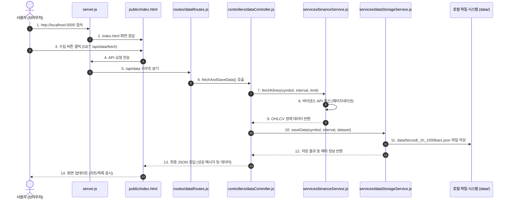

# 서버 아키텍처 및 사용자 인터랙션 흐름 가이드 (Server Architecture Guide)

본 문서는 `cabt_drl` 프로젝트의 서버 구성 요소(Express 서버, 라우터, 컨트롤러, 서비스 모듈)와 사용자가 웹 GUI에서 요청을 보냈을 때 코드가 상호작용하는 흐름을 정리한 아키텍처 설명서입니다.

---

## 1. 사용자 상호작용 흐름도 (Interaction Flow)

사용자가 웹 브라우저 화면에서 **데이터 수집 요청**을 보낼 때 시스템 내부에서 처리되는 데이터 흐름입니다.

---

## 2. 파일별 주요 역할 상세

### 1단계: 서버 가동 및 웹 화면 표시 (시작점)

#### `server.js` (전체 시스템의 문지기 & 엔트리 포인트)
- **역할**: Express 웹 서버를 띄우고, CORS / JSON 미들웨어를 설정하며 모든 HTTP 요청을 가장 먼저 접수합니다.
- **주요 기능**:
  - `public/` 디렉터리의 정적 웹 파일 제공
  - `/api/data` API 라우트 연동
  - `/api/health` 헬스체크 응답 제공

#### `public/index.html` (사용자 대시보드 웹 GUI)
- **역할**: 사용자의 웹 브라우저에 시각적으로 표시되는 HTML 뷰(GUI) 인터페이스입니다.
- **주요 기능**:
  - 심볼(BTCUSDT), 타임프레임(1h 등), 수집 개수를 선택하는 폼(Form) 제공
  - 서버 API로 데이터 수집 및 조회 AJAX 요청 발송
  - (추후 구현) TradingView Lightweight Charts 캔들스틱 시각화 렌더링

---

### 2단계: 요청 분류 및 비즈니스 지휘 (중간 전달)

#### `routes/dataRoutes.js` (API 안내판 / 라우팅)
- **역할**: 사용자가 요청한 API URL 경로(`/api/data/*`)를 확인하고, 적절한 컨트롤러 함수로 안내합니다.
- **주요 경로**:
  - `GET /api/data/fetch`: 데이터 수집 및 자동 저장
  - `GET /api/data/list`: 저장된 데이터 파일 목록 조회
  - `GET /api/data/file/:fileName`: 특정 데이터 파일 상세 내용 조회
  - `DELETE /api/data/file/:fileName`: 저장된 파일 삭제

#### `controllers/dataController.js` (비즈니스 총괄 지휘관)
- **역할**: 라우터로부터 전달받은 사용자 파라미터(쿼리 스트링, URL 매개변수)를 검증하고, 서비스 모듈들을 조율하여 최종 응답(JSON)을 형성합니다.
- **주요 기능**:
  - `fetchAndSaveData`: 수집 서비스와 저장 서비스를 연속 호출하여 데이터 수집/저장 수행
  - `listFiles`: 저장소 서비스에서 파일 목록을 받아 응답
  - `getFileData`: 특정 저장 파일 읽기 수행

---

### 3단계: 실제 데이터 수집 및 로컬 저장 (백엔드 처리)

#### `services/binanceService.js` (외부 통신 전담 모듈)
- **역할**: 바이낸스 선물 REST API(`https://fapi.binance.com/fapi/v1/klines`)와 직접 통신하는 외부 데이터 수집 서비스입니다.
- **주요 기능**:
  - 바이낸스 1회 제한(1,500개)을 넘는 긴 기간 데이터 수집 시 **자동 페이지네이션(Loop) 처리**
  - 원시 캔들 배열을 `timestamp`, `open`, `high`, `low`, `close`, `volume` 형태의 정제된 객체 배열로 변환

#### `services/dataStorageService.js` (로컬 저장소 창고지기)
- **역할**: 수집된 OHLCV 캔들 데이터를 프로젝트 루트의 `data/` 디렉터리에 실제 파일로 저장하고 관리합니다.
- **주요 기능**:
  - `saveData`: 데이터를 JSON 포맷(`meta` + `data`)으로 로컬 파일 작성
  - `listDataFiles`: `data/` 폴더 내 저장된 파일들의 크기, 생성일, 메타 데이터 목록 추출
  - `readDataFile` / `deleteDataFile`: 지정된 데이터 파일 읽기 및 삭제

---

### 🛠️ 보조 모듈

#### `config/constants.js` (공통 규격 지침서)
- **역할**: 프로젝트 전반에서 공통으로 사용되는 상수값들을 중앙에서 정의합니다.
- **주요 정의 항목**:
  - `PORT`: 서버 동작 포트 번호 (기본 5000)
  - `BINANCE_FUTURES_API_URL`: 바이낸스 선물 API 엔드포인트
  - `VALID_INTERVALS`: 바이낸스 허용 타임프레임 목록 (`1m`, `5m`, `15m`, `1h`, `1d` 등)
  - `DATA_DIR`: 로컬 파일 저장 디렉터리 경로 (`data/`)
