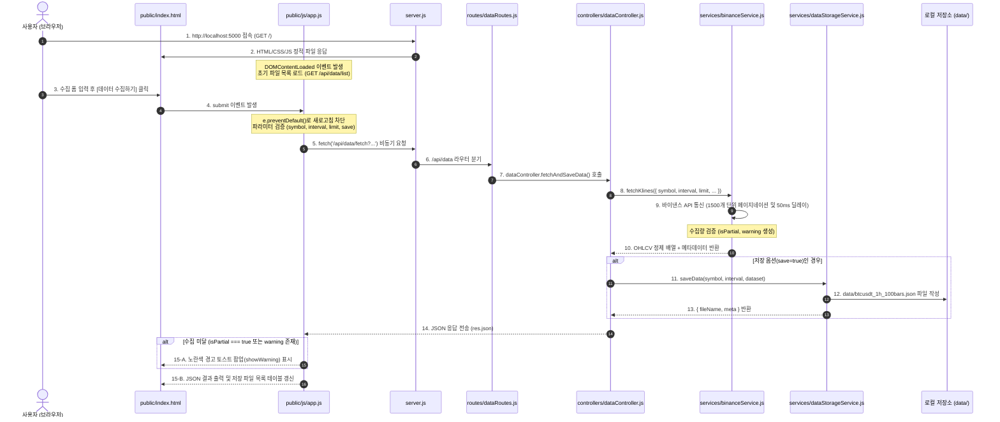

# 서버 및 프론트엔드 아키텍처 가이드 (Architecture & Interaction Flow)

본 문서는 `cabt_drl` 프로젝트의 전체 시스템 구성 요소(Express 백엔드, 프론트엔드 UI/JS, 서비스 및 저장소 모듈)와 데이터 수집/관리 흐름, 그리고 보안 및 예외 처리 아키텍처를 종합 정리한 설명서입니다.

---

## 1. 프로젝트 전체 모듈 구조 (Directory Architecture)

[AGENTS.md](file:///e:/Devs/cabt_drl/AGENTS.md)의 모듈화 규칙에 따라 프론트엔드와 백엔드가 명확한 단일 책임(Single Responsibility)으로 분리되어 있습니다.

```text
cabt_drl/
├── server.js                   # Express 서버 진입점 (미들웨어, 라우팅, 정적 서빙)
├── config/
│   └── constants.js            # API URL, 포트, 지원 타임프레임 등 공통 상수
├── routes/
│   └── dataRoutes.js           # /api/data/* 엔드포인트 라우팅
├── controllers/
│   └── dataController.js       # 요청 파싱 및 서비스 오케스트레이션 (싱글톤)
├── services/
│   ├── binanceService.js       # 바이낸스 선물 Klines API 통신 및 자동 페이지네이션
│   └── dataStorageService.js   # data/ 로컬 파일 읽기/쓰기/삭제 및 보안 격리 (싱글톤)
├── public/                     # 브라우저 프론트엔드 GUI
│   ├── index.html              # HTML 구조 및 폼/테이블 레이아웃
│   ├── css/
│   │   └── style.css           # 다크 테마 UI 및 경고 토스트 스타일
│   └── js/
│       └── app.js              # DOM 제어, fetch API 통신, 이벤트 핸들러
└── data/                       # 수집된 OHLCV 캔들 JSON 파일 저장소
```

---

## 2. 사용자 상호작용 및 데이터 흐름도 (Sequence Diagram)

사용자가 웹 브라우저 화면에서 **데이터 수집 요청**을 보낼 때, 수집 미달 감지 및 파일 목록 갱신까지 이어지는 전체 처리 흐름입니다.



---

## 3. 핵심 모듈별 역할 및 설계 특징

### 3.1. 프론트엔드 계층 (`public/`)

* **`public/index.html` (UI 구조)**
  * 코인 심볼, 타임프레임, 수집 개수(Limit), 저장 여부 선택 폼 제공
  * 수집 미달 알림을 위한 경고 토스트 컨테이너(`<div id="warningToast">`) 배치
  * 저장된 데이터 파일 목록을 표시하고 삭제할 수 있는 데이터 테이블 제공
* **`public/css/style.css` (스타일시트)**
  * 트레이딩 샌드박스에 맞춘 다크 테마 디자인
  * 부드러운 애니메이션(`slideDown`)이 적용된 경고 토스트 UI 스타일링
* **`public/js/app.js` (프론트엔드 비즈니스 로직)**
  * **`DOMContentLoaded`**: HTML 뼈대가 로드된 후 안전하게 자바스크립트 초기화
  * **`e.preventDefault()`**: 폼 제출 시 브라우저 페이지 새로고침을 방지하고 `fetch()`를 통한 비동기 통신 수행
  * **수집 미달 감지**: 백엔드 메타데이터의 `isPartial` / `warning`을 감지하여 경고 토스트 출력
  * **파일 관리**: `GET /api/data/list`로 목록 자동 갱신 및 `DELETE /api/data/file/:fileName` 연동

---

### 3.2. 백엔드 라우팅 및 제어 계층

* **`server.js` (서버 진입점)**
  * `cors()`: 크로스 오리진 요청 허용
  * `express.json()`, `express.urlencoded({ extended: true })`: 요청 본문 파싱
  * `express.static('public')`: 프론트엔드 정적 파일 서빙
  * `app.listen(PORT)`: 5000번 포트에서 이벤트 루프 대기 가동
* **`routes/dataRoutes.js` (API 라우팅 안내판)**
  * `GET /api/data/fetch`: 데이터 수집/저장 라우트
  * `GET /api/data/list`: 파일 목록 조회 라우트
  * `GET /api/data/file/:fileName`: 특정 파일 내용 조회 라우트
  * `DELETE /api/data/file/:fileName`: 특정 파일 삭제 라우트
* **`controllers/dataController.js` (비즈니스 지휘관)**
  * 싱글톤 패턴(`module.exports = new DataController()`)으로 인스턴스 단일화
  * `req.query` 구조분해 할당 및 기본값 처리
  * `binanceService`와 `dataStorageService`를 조율하고 `res.json()`으로 최종 응답

---

### 3.3. 외부 연동 및 저장소 계층 (`services/`)

* **`services/binanceService.js` (바이낸스 선물 API 통신원)**
  * 바이낸스 1회 최대 1,500개 제한을 극복하는 **자동 페이지네이션(Loop) 알고리즘**
  * `await new Promise(resolve => setTimeout(resolve, 50))`: 과도한 호출로 인한 Rate Limit(429) 차단 방지
  * **수집 미달 감지 로직**: 요청한 `limit`보다 수집된 개수가 적을 때 `isPartial: true` 및 `warning` 메시지 자동 생성
* **`services/dataStorageService.js` (로컬 저장소 관리자)**
  * `fs.mkdir(DATA_DIR, { recursive: true })`: 디렉터리 자동 보장
  * `Promise.all()` 병렬 처리를 통한 고속 파일 목록 조회
  * **보안 방어 (`path.basename`)**: `../../.env` 같은 상위 경로 이탈 공격(Path Traversal Attack)을 원천 차단하여 `data/` 디렉터리 내로 파일 접근 격리
